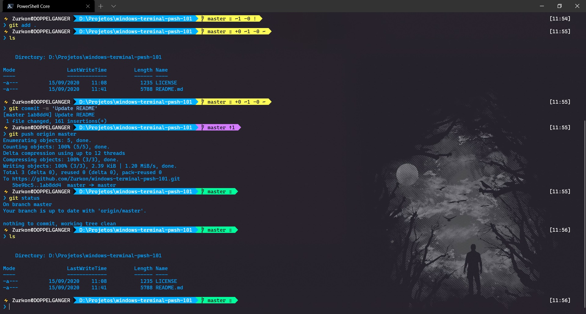

# Beautify your Windows Terminal and Powershell
Step-by-step tutorial to customize the Windows Terminal and Powershell Core



# Getting Started
## Installing Windows Terminal
```
Invoke-WebRequest -Uri https://github.com/microsoft/terminal/releases/download/v1.5.10411.0/Microsoft.WindowsTerminal_1.5.10411.0_8wekyb3d8bbwe.msixbundle -OutFile WindowsTerminal.appx -UseBasicParsing
```

```
Add-AppxPackage .\WindowsTerminal.appx
```

## Installing Powershell Core
```
Invoke-WebRequest -Uri https://github.com/PowerShell/PowerShell/releases/download/v7.0.1/PowerShell-7.0.1-win-x64.msi -OutFile PowerShell.msi -UseBasicParsing
```

```
msiexec.exe /package PowerShell.msi /quiet ADD_EXPLORER_CONTEXT_MENU_OPENPOWERSHELL=1 ENABLE_PSREMOTING=1 REGISTER_MANIFEST=1
```

# Powerline Setup
The next codes you must run them inside Powershell Core prompt.

1. Install the `PSReadline`:
```powershell
Install-Module -Name PSReadLine -AllowPrerelease -Scope CurrentUser -Force -SkipPublisherCheck
```
2. Install `oh-my-posh`:
```powershell
Install-Module posh-git -Scope CurrentUser
Install-Module oh-my-posh -Scope CurrentUser
```
> Obs: You must have installed [`Git for Windows`](https://git-scm.com/downloads).

> Install [`Cascadia code PL`](https://github.com/microsoft/cascadia-code/releases) font. (Otherwise you might some gibberish on your terminal )

## Customize your Powershell Profile
You can open your Powershell Profile with the command below:
```powershell
notepad $PROFILE
```

If your powershell doesn't already have a profile, create one :
```powershell
if (!(Test-Path -Path $PROFILE)) { New-Item -ItemType File -Path ROFILE -Force }
```

Now go ahead and add the following code to your Powershell Profile:
```
Import-Module posh-git
Import-Module oh-my-posh
Set-Theme Paradox
```

# Windows Terminal Setup
Open the Windows Terminal `setting.json`.
My Custom `setting.json`:
```
// To view the default settings, hold "alt" while clicking on the "Settings" button.
// For documentation on these settings, see: https://aka.ms/terminal-documentation
{
    "$schema": "https://aka.ms/terminal-profiles-schema",
    "defaultProfile": "{574e775e-4f2a-5b96-ac1e-a2962a402336}",
    // Launch Settings
    // "initialCols": 120,
    // "initialRows": 30,
    "launchMode": "maximized",
    "alwaysOnTop": false,
    // Selection
    "copyOnSelect": false,
    "copyFormatting": true,
    "wordDelimiters": " /\\()\"'-.,:;<>~!@#$%^&*|+=[]{}~?\u2502",
    // Tab UI
    "alwaysShowTabs": true,
    "showTabsInTitlebar": true,
    "showTerminalTitleInTitlebar": true,
    "tabWidthMode": "equal",
    // Miscellaneous
    "confirmCloseAllTabs": true,
    "startOnUserLogin": false,
    "theme": "system",
    "snapToGridOnResize": true,
    "profiles": {
        "defaults": {
            // Put settings here that you want to apply to all profiles
            "fontSize": 10,
            "suppressApplicationTitle": true,
            "backgroundImage": "C:\\Users\\lukey\\AppData\\Local\\Packages\\Microsoft.WindowsTerminal_8wekyb3d8bbwe\\RoamingState\\backgroundDefault.jpg",
            "backgroundImageOpacity": 0.8,
            "colorScheme": "Blue Matrix",
            "useAcrylic": true,
            "acrylicOpacity": 0.8
        },
        "list": [
            {
                "guid": "{574e775e-4f2a-5b96-ac1e-a2962a402336}",
                "hidden": false,
                "name": "PowerShell Core",
                "commandline": "pwsh.exe -NoLogo",
                "source": "Windows.Terminal.PowershellCore",
                "fontFace": "Cascadia Code PL",
                "startingDirectory": "D:\\"
            },
            {
                // Make changes here to the powershell.exe profile
                "guid": "{61c54bbd-c2c6-5271-96e7-009a87ff44bf}",
                "name": "Windows PowerShell",
                "commandline": "powershell.exe",
                "hidden": true
            },
            {
                // Make changes here to the cmd.exe profile
                "guid": "{0caa0dad-35be-5f56-a8ff-afceeeaa6101}",
                "name": "cmd",
                "commandline": "cmd.exe",
                "hidden": false
            },
            {
                "guid": "{b453ae62-4e3d-5e58-b989-0a998ec441b8}",
                "hidden": true,
                "name": "Azure Cloud Shell",
                "source": "Windows.Terminal.Azure"
            }
        ]
    },
    // Add custom color schemes to this array
    "schemes": [
        {
            "name": "Blue Matrix",
            "black": "#101116",
            "red": "#ff5680",
            "green": "#00ff9c",
            "yellow": "#fffc58",
            "blue": "#00b0ff",
            "purple": "#d57bff",
            "cyan": "#76c1ff",
            "white": "#c7c7c7",
            "brightBlack": "#686868",
            "brightRed": "#ff6e67",
            "brightGreen": "#5ffa68",
            "brightYellow": "#fffc67",
            "brightBlue": "#6871ff",
            "brightPurple": "#d682ec",
            "brightCyan": "#60fdff",
            "brightWhite": "#ffffff",
            "background": "#101116",
            "foreground": "#00a2ff"
        }
    ],
    // Add any keybinding overrides to this array.
    // To unbind a default keybinding, set the command to "unbound"
    "keybindings": []
}
```

> Obs: Don't forget to change `"backgroundImage"` on defaults Profile and `"startingDirectory"` on Powershell Core Profile

## Adding Thunder emoji ⚡ on my prompt
Navigate to your PSmodules directory, then into oh-my-posh themes directory:
```
Documents\WindowsPowerShell\Modules\oh-my-posh\2.0.412\Themes
```
> Obs: Sometimes will be in your `Documents` folder inside your `User` Folder or `OneDrive` Folder.

> Some versions the `WindowsPowerShell` folder would be just `PowerShell`

Open the `paradox.psm1` and update the following line:
```
$sl.PromptSymbols.StartSymbol = [char]::ConvertFromUtf32(0x26A1) + ' '
```

# Final Result


# Useful Resources
[Windows Terminal Profile Settings Documentation](https://docs.microsoft.com/en-us/windows/terminal/customize-settings/profile-settings)

[Windows Terminal Color Schemes](https://windowsterminalthemes.dev/)

[DEV TO - Beautify your Windows Terminal](https://dev.to/anupa/beautify-your-windows-terminal-1la8)

[oh-my-posh repository](https://github.com/JanDeDobbeleer/oh-my-posh)
